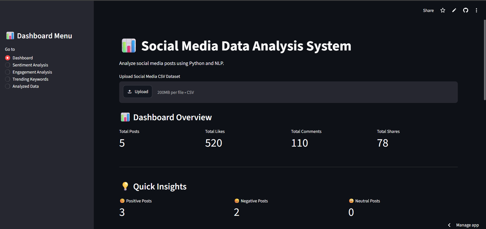
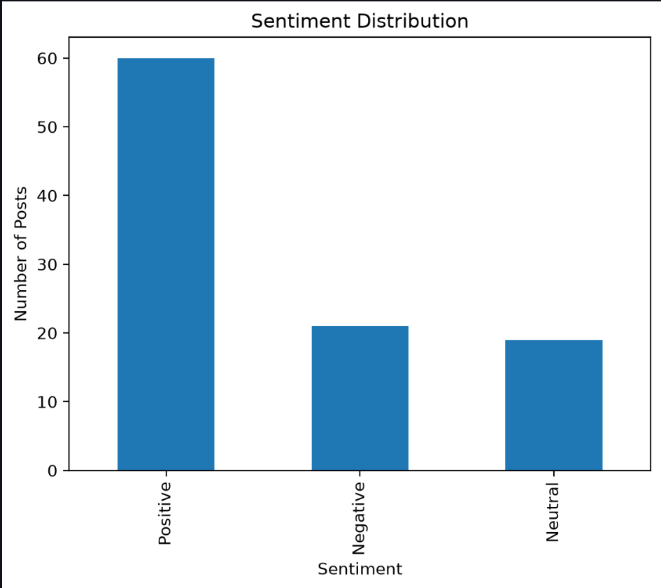
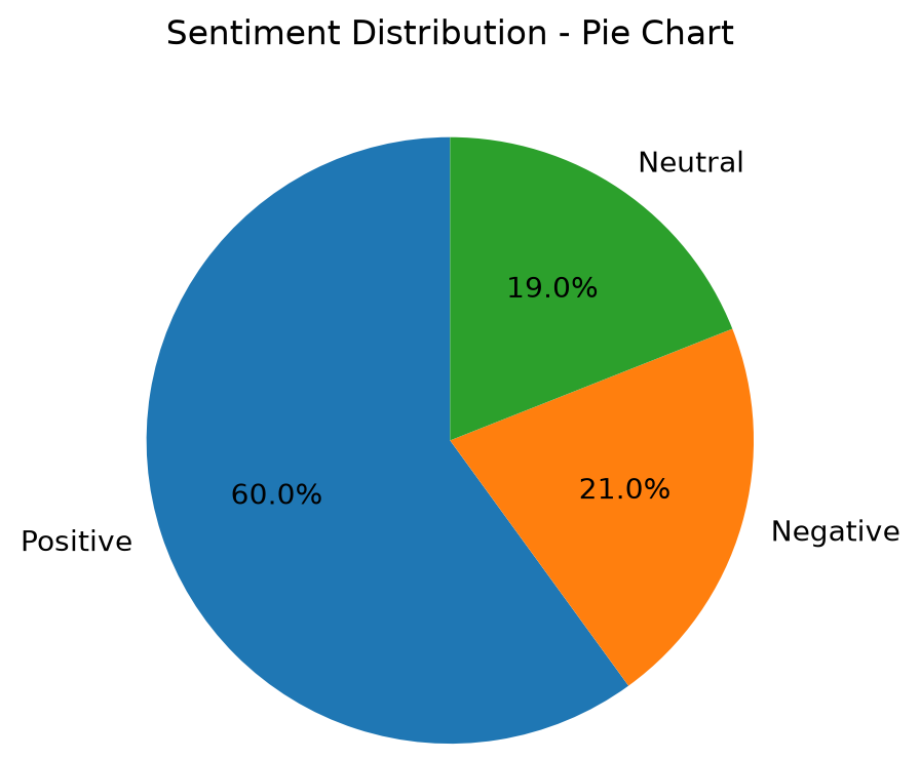
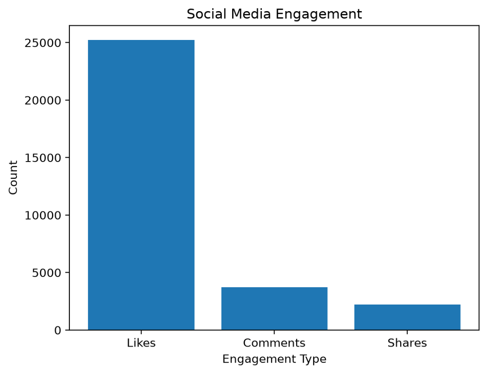
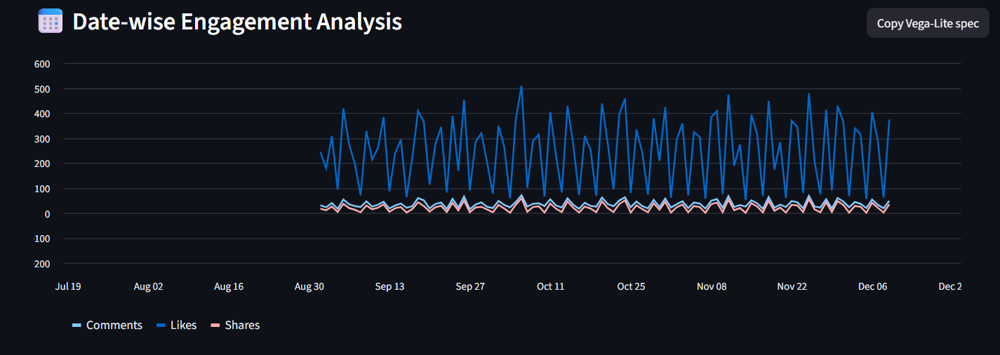

# 📊 Social Media Data Analysis System

A Python and Streamlit web app that analyses social media posts. It cleans the data, classifies sentiment with TextBlob, measures engagement, finds trending keywords and shows everything on an interactive dashboard.

> **Data Analysis Essentials – Cornerstone Project** · Department of Artificial Intelligence & Machine Learning

🌐 **Live app:** https://social-media-analysis-tharun.streamlit.app/


---

## Table of Contents

1. [Overview](#overview)
2. [Features](#features)
3. [Screenshots](#screenshots)
4. [Tech Stack](#tech-stack)
5. [Project Structure](#project-structure)
6. [Dataset Format](#dataset-format)
7. [How It Works](#how-it-works)
8. [Installation and Run Locally](#installation-and-run-locally)
9. [Dashboard Modules](#dashboard-modules)
10. [Deployment](#deployment)


---

## Overview

Social media platforms produce thousands of posts every day, and reading them by hand is slow, biased and hard to scale. This project automates the work:

- Loads a CSV of posts (or one you upload in the app)
- Cleans the data (drops unnamed columns, missing values and duplicates)
- Classifies each post as **Positive**, **Negative** or **Neutral**
- Calculates **Total Engagement = Likes + Comments + Shares**
- Extracts the most-used keywords and draws a **word cloud**
- Shows the results in a multi-page **Streamlit dashboard**

## Features

| Area | What you get |
|------|--------------|
| Data cleaning | Removes unnamed columns, null rows and duplicate records |
| Sentiment analysis | TextBlob polarity score mapped to Positive, Negative or Neutral |
| Engagement analysis | Average likes, comments and shares, totals, and a date-wise trend |
| Top posts | Most engaging post and a top-5 table |
| Trending keywords | Top-10 keyword list and word cloud, with stop words removed |
| Visualisations | Bar chart, pie chart, line chart and word cloud |
| Search and filter | Filter by sentiment, search by Post ID or keyword |
| Upload and export | Upload your own CSV and download the analysed data as CSV |

## Screenshots

### Dashboard overview


### Sentiment analysis
| Bar chart | Pie chart |
|:---:|:---:|
|  |  |

### Engagement analysis
| Likes, comments and shares | Date-wise trend |
|:---:|:---:|
|  |  |

> The screenshots above were taken with a larger sample dataset. The `social_media_data.csv` bundled in this repo is a small 5-post demo file, so your numbers will differ when you run it.

## Tech Stack

| Purpose | Tool |
|---------|------|
| Language | Python 3 |
| Data handling | Pandas |
| Sentiment analysis | TextBlob |
| Charts | Matplotlib, Streamlit charts |
| Word cloud | WordCloud |
| Web dashboard | Streamlit |
| Version control and hosting | GitHub, Streamlit Community Cloud |

## Project Structure

```
social-media-data-analysis/
├── dashboard.py            # Streamlit app: cleaning, analysis and all dashboard pages
├── sentiment.py            # Standalone sentiment helper (TextBlob)
├── social_media_data.csv   # Sample dataset
├── requirements.txt        # Python dependencies
├── README.md               # Project documentation
├── .gitignore
└── assets/
    └── screenshots/        # Images used in this README
```

## Dataset Format

The CSV must contain these columns:

| Column | Description |
|--------|-------------|
| `Post_ID` | Unique post identifier |
| `Text` | Post text or caption |
| `Likes` | Number of likes |
| `Comments` | Number of comments |
| `Shares` | Number of shares |
| `Date` | Post date (e.g. `01-09-2026`) |

Example:

```csv
Post_ID,Text,Likes,Comments,Shares,Date
1,I love this new app,120,25,15,01-09-2026
2,This app is very slow,35,18,5,01-09-2026
```

## How It Works

```
CSV file → Clean data → TextBlob polarity → Sentiment label
                      → Likes + Comments + Shares → Total Engagement
                      → Word frequency → Trending keywords / Word cloud
                      → Streamlit dashboard (charts, tables, search, download)
```

**Sentiment rule**

| Polarity score | Label |
|----------------|-------|
| greater than 0 | Positive |
| less than 0 | Negative |
| equal to 0 | Neutral |

## Installation and Run Locally

**Prerequisites:** Python 3.8 or higher and pip.

```bash
# 1. Clone the repository
git clone https://github.com/tharunrudrakshula55-colla/social-media-data-analysis.git
cd social-media-data-analysis

# 2. (Optional) create a virtual environment
python -m venv venv
venv\Scripts\activate          # Windows
# source venv/bin/activate     # macOS / Linux

# 3. Install dependencies
pip install -r requirements.txt

# 4. Start the dashboard
streamlit run dashboard.py
```

The app opens at `http://localhost:8501`. It loads `social_media_data.csv` by default, or you can upload your own CSV from the top of the page.

## Dashboard Modules

| Page | Description |
|------|-------------|
| **Dashboard** | Totals for posts, likes, comments and shares, sentiment counts and percentages, negative feedback table, most engaging post, top 5 posts |
| **Sentiment Analysis** | Bar and pie charts, plus a filter to view posts by sentiment |
| **Engagement Analysis** | Average likes, comments and shares, engagement bar chart, date-wise trend, top posts |
| **Trending Keywords** | Top-10 keywords and word cloud |
| **Analyzed Data** | Search by Post ID or keyword, download the analysed CSV, view the full table |

## Deployment

The app is deployed on **Streamlit Community Cloud** straight from this GitHub repository.

1. Push the code to GitHub.
2. Sign in at [share.streamlit.io](https://share.streamlit.io) with GitHub.
3. Click **New app**, select the repository, set the main file to `dashboard.py` and deploy.

